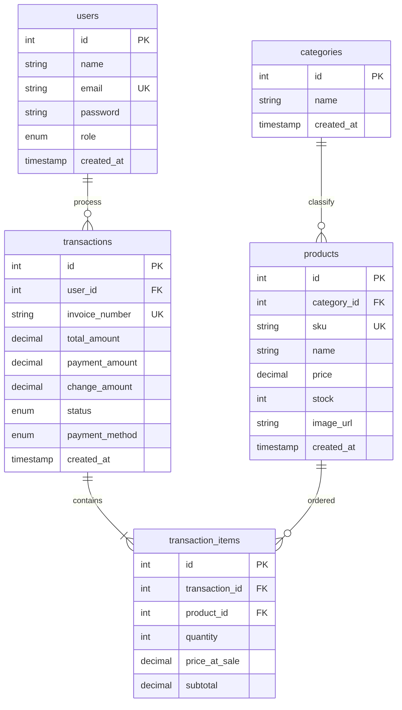

# Skema Database MVP POS (Tanpa Keranjang User)

Dokumen ini berisi rancangan skema database MVP untuk sistem Point of Sale (POS) tanpa keranjang penyimpanan untuk user (transaksi langsung tercatat).

## Entity Relationship Diagram (ERD)



## Detail Tabel

### 1. Tabel: `users`
| Kolom | Tipe Data | Atribut / Constraint | Deskripsi |
| :--- | :--- | :--- | :--- |
| **id** | INT | PRIMARY KEY, AUTO_INCREMENT | ID unik user |
| **name** | VARCHAR(100) | NOT NULL | Nama user/admin |
| **email** | VARCHAR(100) | UNIQUE, NOT NULL | Email login |
| **password** | VARCHAR(255) | NOT NULL | Password terenkripsi |
| **role** | ENUM('admin', 'user') | DEFAULT 'user' | Hak akses sistem |
| **created_at** | TIMESTAMP | DEFAULT CURRENT_TIMESTAMP | Waktu pendaftaran |

### 2. Tabel: `categories`
| Kolom | Tipe Data | Atribut / Constraint | Deskripsi |
| :--- | :--- | :--- | :--- |
| **id** | INT | PRIMARY KEY, AUTO_INCREMENT | ID unik kategori |
| **name** | VARCHAR(100) | NOT NULL | Nama kategori produk |
| **created_at** | TIMESTAMP | DEFAULT CURRENT_TIMESTAMP | Waktu pembuatan |

### 3. Tabel: `products`
| Kolom | Tipe Data | Atribut / Constraint | Deskripsi |
| :--- | :--- | :--- | :--- |
| **id** | INT | PRIMARY KEY, AUTO_INCREMENT | ID unik produk |
| **category_id** | INT | FOREIGN KEY (`categories.id`), NULLable | Kategori produk |
| **sku** | VARCHAR(50) | UNIQUE, NOT NULL | Kode unik stock keeping unit |
| **name** | VARCHAR(150) | NOT NULL | Nama produk |
| **price** | DECIMAL(10,2) | NOT NULL | Harga produk |
| **stock** | INT | NOT NULL, DEFAULT 0 | Stok saat ini |
| **image_url** | VARCHAR(255) | NULLable | URL gambar produk |
| **created_at** | TIMESTAMP | DEFAULT CURRENT_TIMESTAMP | Waktu penambahan produk |

### 4. Tabel: `transactions`
| Kolom | Tipe Data | Atribut / Constraint | Deskripsi |
| :--- | :--- | :--- | :--- |
| **id** | INT | PRIMARY KEY, AUTO_INCREMENT | ID unik transaksi |
| **user_id** | INT | FOREIGN KEY (`users.id`), NOT NULL | Pelanggan yang melakukan transaksi |
| **invoice_number** | VARCHAR(50) | UNIQUE, NOT NULL | Nomor invoice transaksi |
| **total_amount** | DECIMAL(10,2) | NOT NULL | Total harga belanja |
| **payment_amount**| DECIMAL(10,2) | NOT NULL | Uang yang dibayarkan pelanggan |
| **change_amount** | DECIMAL(10,2) | NOT NULL | Uang kembalian |
| **status** | ENUM('pending', 'completed', 'cancelled') | DEFAULT 'pending' | Status pembayaran transaksi |
| **payment_method**| ENUM('qris', 'ovo', 'dana', 'paypal','bayar ditempat') | NULLable | Metode pembayaran yang digunakan |
| **created_at** | TIMESTAMP | DEFAULT CURRENT_TIMESTAMP | Waktu transaksi dilakukan |

### 5. Tabel: `transaction_items`
| Kolom | Tipe Data | Atribut / Constraint | Deskripsi |
| :--- | :--- | :--- | :--- |
| **id** | INT | PRIMARY KEY, AUTO_INCREMENT | ID unik item transaksi |
| **transaction_id**| INT | FOREIGN KEY (`transactions.id`) ON DELETE CASCADE | Relasi ke transaksi utama |
| **product_id** | INT | FOREIGN KEY (`products.id`), NOT NULL | Relasi ke produk yang dibeli |
| **quantity** | INT | NOT NULL | Jumlah barang yang dibeli |
| **price_at_sale** | DECIMAL(10,2) | NOT NULL | Harga produk saat transaksi berlangsung |
| **subtotal** | DECIMAL(10,2) | NOT NULL | Hasil perkalian quantity dengan price_at_sale |

## DDL SQL

```sql
CREATE TABLE users (
    id INT AUTO_INCREMENT PRIMARY KEY,
    name VARCHAR(100) NOT NULL,
    email VARCHAR(100) UNIQUE NOT NULL,
    password VARCHAR(255) NOT NULL,
    role ENUM('admin', 'user') DEFAULT 'user',
    created_at TIMESTAMP DEFAULT CURRENT_TIMESTAMP
);

CREATE TABLE categories (
    id INT AUTO_INCREMENT PRIMARY KEY,
    name VARCHAR(100) NOT NULL,
    created_at TIMESTAMP DEFAULT CURRENT_TIMESTAMP
);

CREATE TABLE products (
    id INT AUTO_INCREMENT PRIMARY KEY,
    category_id INT,
    sku VARCHAR(50) UNIQUE NOT NULL,
    name VARCHAR(150) NOT NULL,
    price DECIMAL(10, 2) NOT NULL,
    stock INT NOT NULL DEFAULT 0,
    image_url VARCHAR(255),
    created_at TIMESTAMP DEFAULT CURRENT_TIMESTAMP,
    FOREIGN KEY (category_id) REFERENCES categories(id) ON DELETE SET NULL
);

CREATE TABLE transactions (
    id INT AUTO_INCREMENT PRIMARY KEY,
    user_id INT NOT NULL,
    invoice_number VARCHAR(50) UNIQUE NOT NULL,
    total_amount DECIMAL(10, 2) NOT NULL,
    payment_amount DECIMAL(10, 2) NOT NULL,
    change_amount DECIMAL(10, 2) NOT NULL,
    status ENUM('pending', 'completed', 'cancelled') DEFAULT 'pending',
    payment_method ENUM('qris', 'ovo', 'dana', 'paypal'),
    created_at TIMESTAMP DEFAULT CURRENT_TIMESTAMP,
    FOREIGN KEY (user_id) REFERENCES users(id)
);

CREATE TABLE transaction_items (
    id INT AUTO_INCREMENT PRIMARY KEY,
    transaction_id INT NOT NULL,
    product_id INT NOT NULL,
    quantity INT NOT NULL,
    price_at_sale DECIMAL(10, 2) NOT NULL,
    subtotal DECIMAL(10, 2) NOT NULL,
    FOREIGN KEY (transaction_id) REFERENCES transactions(id) ON DELETE CASCADE,
    FOREIGN KEY (product_id) REFERENCES products(id)
);
```
